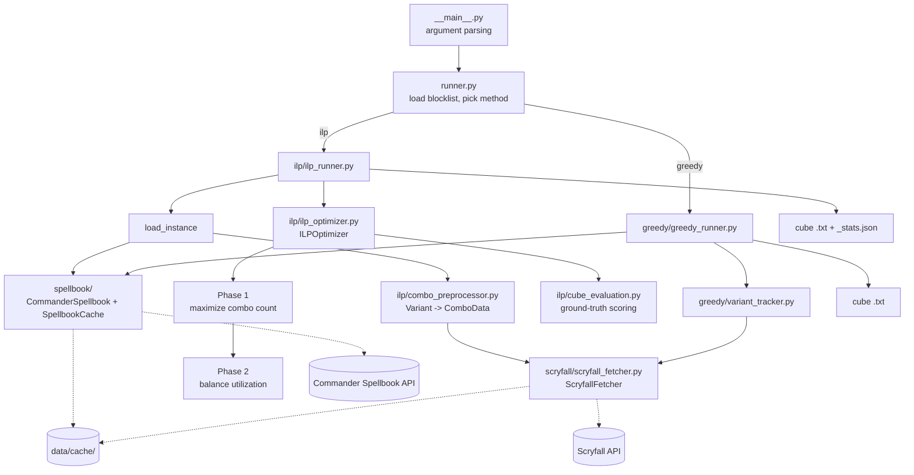

# Architecture

This document describes the system as it is implemented today. For how it got here, including
benchmark results and the reasoning behind decisions, see the documents in [plans/](plans/).
For setup, flags and usage, see the [project README](../README.md).

## Purpose

Given a cube size N, pick N Magic: The Gathering cards so that as many combos as possible can be
assembled from the cube, and so that the cards are used by a comparable number of combos rather
than a few hub cards carrying everything. Combo data comes from the
[Commander Spellbook](https://commanderspellbook.com/) API. Template requirements such as
"a creature with persist" are resolved to concrete cards through the
[Scryfall](https://scryfall.com/) API.

Two builders exist:

- **ILP** (default): an exact model solved with the OR-Tools CP-SAT solver, in two phases.
- **Greedy**: the original heuristic. Fast, no optimality guarantee, kept for comparison.

## System overview



## Package layout

All code lives under `src/mtg_combo_cube/`.

| Module | Responsibility |
|--------|----------------|
| `__main__.py` | CLI. Parses flags and calls `runner.run`. |
| `runner.py` | Loads the blocklist and dispatches to the ILP or greedy runner. |
| `models.py` | Pydantic models for Commander Spellbook responses (`Variant`, `CardUse`, `Requirement`, `Template`, ...). |
| `blocklist.py` | Reads `data/blocklist.txt`: one card name per line, `#` comments allowed. |
| `spellbook/commander_spellbook.py` | Async client for the Spellbook API: paged variant listing and the "find my combos" endpoint. |
| `spellbook/api_cache.py` | `SpellbookCache`: file cache for the variant listing. |
| `scryfall/scryfall_fetcher.py` | `ScryfallFetcher`: template lookups with disk cache, rate limiting and retries. Shared by both builders. |
| `ilp/requirement_normalizer.py` | Canonical keys for template requirements and URL preparation for Scryfall. |
| `ilp/combo_preprocessor.py` | Turns variants into the ILP instance (`ComboData`, `CandidateCard`). |
| `ilp/ilp_models.py` | Dataclasses for the instance, statistics and `OptimizationResult`. |
| `ilp/ilp_optimizer.py` | `ILPOptimizer`: builds and solves the CP-SAT models. |
| `ilp/cube_evaluation.py` | Pure functions that score a set of cards: completed combos, utilization, statistics. |
| `ilp/evaluate_cube.py` | Command-line entry point that scores an existing cube file. |
| `ilp/profiling.py` | Timing, variable and constraint counts, solver statistics. |
| `ilp/ilp_runner.py` | Orchestrates an ILP build and writes the outputs. |
| `greedy/greedy_runner.py` | The greedy builder. |
| `greedy/variant_tracker.py` | Card frequency and popularity tallies for the greedy builder. |

## Data pipeline

### 1. Fetch variants

`CommanderSpellbook.get_variants` pages through the Spellbook API, most popular first, keeping
combos of at most four cards and skipping any that need a specific commander. It stops after
`--max-variants` combos. `SpellbookCache` stores the result in
`data/cache/variants_cards{K}_max{N}.json`.

### 2. Preprocess into an ILP instance

`ComboPreprocessor.preprocess_variants` converts each variant into a `ComboData`:

- `required_cards`: the specific cards the combo names.
- `requirement_options`: one entry per template requirement. Each holds the pool of cards that
  can satisfy it, and a `group_key` that identifies the same template across combos.

A template's pool is the first ten cards Scryfall returns for the template's search, ordered by
EDHREC rank, after removing blocklisted cards.

A combo is left out of the instance for one of four reasons, counted in `DropReason` and logged
in one summary line:

| Reason | Meaning |
|--------|---------|
| `blocked_card` | A required card is on the blocklist. |
| `no_scryfall_api` | A requirement has no Scryfall search, so it cannot be resolved to cards. |
| `scryfall_failure` | The Scryfall lookup failed after retries. Logged as a warning, since it changes the instance. |
| `empty_match` | The search matched no usable card. |

The preprocessor also returns the card universe as `CandidateCard` objects, each recording the
combos that require the card and the template groups it can satisfy.

### 3. Scryfall access

`ScryfallFetcher` returns the raw ordered card names for a search URL. Callers apply their own
blocklist and limit afterwards, so the cache stays valid when those change.

- **Cache:** one file, `data/cache/scryfall_templates.json`, keyed by the prepared URL. Written
  to a temporary file and then swapped in, flushed every 50 new results and on close.
- **Politeness:** one shared HTTP session, 100 ms between requests, an identifying `User-Agent`.
- **Retries:** up to five attempts on HTTP 429, 5xx and network errors, with doubling backoff
  that respects `Retry-After`.
- **Outcomes:** a 404 means "no cards match" and is cached as an empty result. A failure is
  never cached.

### Cache flags

Both caches follow the same two flags. Reads happen only with `--read-api-cache`. Writes happen
unless `--skip-api-caching` is given. With a warm cache, an ILP run makes no network requests.
The greedy builder uses the Scryfall cache but always calls the Spellbook API live.

## The ILP optimizer

`ILPOptimizer` takes the instance, the cube size and the tuning parameters. Its entry points are
`solve()` for Phase 1 alone (`--single-phase`) and `solve_two_phase()` for the default flow.

### Base model

Shared by every phase, built by `_build_base_model`:

```
x[c] in {0,1}     card c is in the cube
y[j] in {0,1}     combo j is counted as complete

sum_c x[c] = N                                  cube size
y[j] <= x[c]            for each required card c of combo j
y[j] <= sum x[c]        over the pool of each template requirement of combo j
```

These constraints only stop `y[j]` from being 1 when the cube is missing something. That is
sufficient whenever `y` is being maximized.

### Phase 1: maximize combo count

```
maximize  sum_j w[j] * y[j]        w[j] = 1 + 0.001 * log(1 + popularity[j])
```

Popularity is a tiebreak only. Weights are scaled to integers for CP-SAT.

### Phase 2: balance utilization

Phase 2 builds a fresh model: the base model plus the following, in this order.

1. **Combo count window.** The combo count must stay within `--combo-tolerance` of the Phase 1
   count (10% by default).
2. **Coverage constraints.** For each template group used by at least 10 combos, the cube must
   contain at least `--min-coverage-ratio` x (combos using it) cards from the group's pool,
   capped at the pool size.
3. **Exact combo linking.** `y[j]` is forced to 1 whenever the cube completes combo j. Each
   distinct option pool gets one boolean `z` meaning "at least one card of this pool is
   selected", shared by every combo using that pool. Then `y[j] >= (satisfied parts) - (k - 1)`
   over the k required cards and pools of the combo. Without this, an objective that rewards low
   utilization could switch off combos the cube actually completes.
4. **Utilization variables.** `u[c]` is the number of completed combos card c takes part in, or
   0 when c is not selected. A card takes part in a combo if it is a required card or appears in
   one of the combo's template pools. `u[c]` is bounded by the number of combos c appears in.
5. **Utilization floor.** Every selected card must have `u[c] >= --min-util-floor` (default 2).
   A card that can never reach the floor is excluded outright.
6. **The objective**, chosen with `--phase2-objective`.
7. **Warm start.** The model is hinted with a starting cube.

#### Objectives

Each objective is a method registered in `ILPOptimizer._PHASE2_OBJECTIVES`. It receives the
model and the utilization variables, adds what it needs, and sets the objective. Adding an
objective means writing one `_add_<name>_objective` method, registering it, and adding the name
to the CLI choices.

| Name | Minimizes | Notes |
|------|-----------|-------|
| `tiered` (default) | Utilization above T, plus above 2T, plus above 4T | Convex penalty: one card far above the cap costs more than several slightly above it. |
| `softcap` | Total utilization above a cap T | Penalizes every over-used card equally per unit. |
| `maxutil` | The highest utilization of any selected card | The floor handles the low end. |
| `minmax` | Highest minus lowest utilization | Two auxiliary variables. |
| `mad` | Total absolute deviation from the Phase 1 mean | Two deviation variables per card. |

The cap T is `--util-cap` when given, otherwise twice the Phase 1 median utilization.

Every objective subtracts a small versatility bonus for cards that satisfy more template groups.
For all but `mad`, the main term is scaled so that the bonus can never outweigh one unit of it.

#### Stopping

Each phase has its own `--time-limit`. Phase 2 also stops early once the solution is proven
within `--gap-limit` of optimal (5% by default). For `softcap` and `tiered` the optimum can be
near zero, where a relative gap is meaningless, so the limit is measured as a fraction of the
Phase 1 cube's overage instead.

#### Warm start

The Phase 1 cube usually violates the coverage constraints, which would make it an infeasible
hint. `_build_warm_start` checks this. When the cube is infeasible, it solves the small Phase 1
model with the coverage, combo-window and floor constraints added, stops at the first solution,
and uses that cube as the hint. This repair takes at most 10% of the Phase 2 time limit and
counts against it.

#### Fallback

If Phase 2 finds no solution, the Phase 1 result is returned with `phase2_fell_back` set, along
with the Phase 2 status, time and profile. The stats file then reports
`two_phase_fallback_to_phase1`.

### Ground-truth reporting

No reported number is read from the solver's `y` variables. After each solve, `_extract_solution`
takes the selected cards and calls `cube_evaluation` to recompute which combos are complete and
each card's utilization. If the solver's view disagrees, a warning is logged. The same functions
back the `evaluate_cube` command, so a cube file scored later gives the same numbers as the run
that produced it.

### Solver configuration

CP-SAT runs with `--workers` parallel search workers, 8 by default. CP-SAT chooses its search
strategies based on the worker count, and with fewer than 8 it fails to prove Phase 1 optimal on
this problem. `--debug` turns on the solver's search log. `--profile` records variable and
constraint counts, timings and solver statistics per phase.

## The greedy builder

`GreedyRunner` works in steps:

1. Tally cards across the most popular variants with `VariantTracker`, resolving templates to
   the top five Scryfall matches.
2. Take the top `cube_size / ratio` cards by popularity (`--ratio`, default 1.2).
3. Ask Spellbook which combos are almost complete given those cards, and add the most frequent
   missing cards.
4. Remove dead cards, meaning cards that appear in only one combo of the cube.
5. Refill to the cube size from the almost-complete combos.

It ignores the ILP-only flags, including `--max-variants`.

## Outputs

| File | Written by | Contents |
|------|------------|----------|
| `<output>.txt` | Both builders | The cube, one card name per line. |
| `<output>_stats.json` | ILP only | Metadata, Phase 1 and Phase 2 utilization statistics, improvement and card changes, most and least used cards, per-template coverage, cross-template overlap, and profiling data when `--profile` is set. |

The stats file's `optimization_method` is `single_phase`, `two_phase` or
`two_phase_fallback_to_phase1`. Its `phase2` block records the objective and the cap T used.

`data/current_best_cube.txt` and its stats file are the tracked reference result. Everything else
under `data/` is ignored by git, including `data/cache/`.

## Testing

Unit tests live in `tests/unit/` and run with `task test`. `task check` adds lint, format and
type checking.

- **Optimizer:** behavior tests, characterization tests on a fixed small instance solved to
  optimality with one worker, and brute-force checks of each Phase 2 objective's optimum.
- **Evaluation:** the completion and utilization functions.
- **Data layer:** the Scryfall fetcher against a fake HTTP session (cache hit and miss, retries,
  failures, 404), the preprocessor, the requirement normalizer, the blocklist.
- **Wiring:** a test that defaults agree across the CLI, both runners and the optimizer.

No test touches the network.

## Known limitations

These are open design questions rather than defects. Details are in
[plans/ilp-improvement-plan.md](plans/ilp-improvement-plan.md) under "Follow-ups".

- **Utilization definition.** A card is counted for every completed combo whose template pool
  contains it, even when a different card fills that slot. Combined with the coverage
  constraints, this gives every card in a popular pool a high utilization that no objective can
  lower.
- **Coverage is Phase 2 only.** Phase 1 does not see the coverage constraints, so a combo
  tolerance of 0 can be infeasible.
- **Phase 2 does not finish early at full size.** At 300 cards and 10,000 variants it runs to
  its time limit and returns the best cube found.
- **Run-to-run variation.** A time-limited parallel search does not return the same cube twice.
- **Template pools are truncated.** Only the first ten Scryfall matches are considered.
