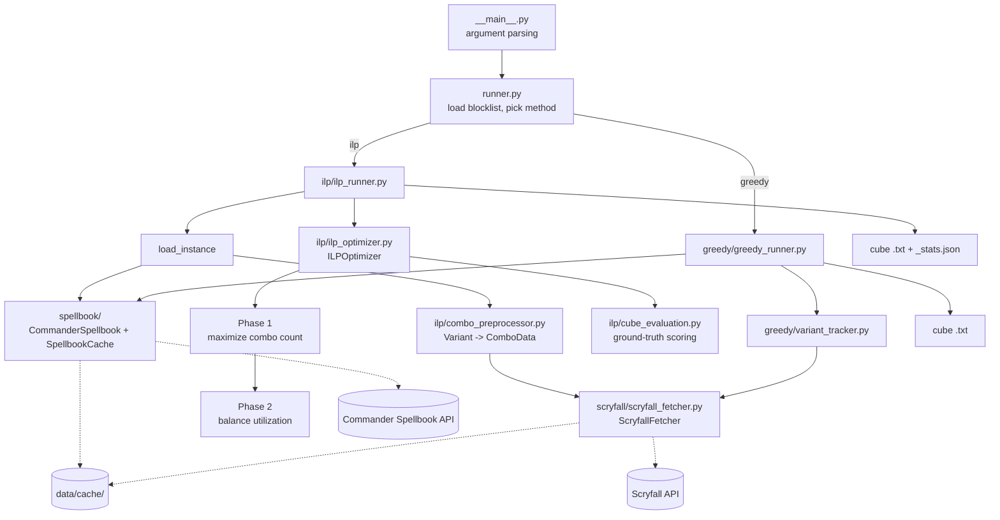

# Architecture

This document describes the system as it is implemented today. For how it got here, including
benchmark results and the reasoning behind decisions, see the documents in [plans/](plans/).
For setup, flags and usage, see the [project README](../README.md).

## Purpose

Given a cube size N, pick N Magic: The Gathering cards so that as many combos as possible can be
assembled from the cube, and so that the cards are used by a comparable number of combos rather
than a few hub cards carrying everything. Combo data comes from the
[Commander Spellbook](https://commanderspellbook.com/) API. Template requirements such as
"a creature with persist" are resolved to concrete cards through the
[Scryfall](https://scryfall.com/) API.

Two builders exist:

- **ILP** (default): an exact model solved with the OR-Tools CP-SAT solver, in two phases.
- **Greedy**: the original heuristic. Fast, no optimality guarantee, kept for comparison.

## System overview



## Package layout

All code lives under `src/mtg_combo_cube/`.

| Module | Responsibility |
|--------|----------------|
| `__main__.py` | CLI. Parses flags and calls `runner.run`. |
| `runner.py` | Loads the blocklist and dispatches to the ILP or greedy runner. |
| `models.py` | Pydantic models for Commander Spellbook responses (`Variant`, `CardUse`, `Requirement`, `Template`, ...). |
| `blocklist.py` | Reads `data/blocklist.txt`: one card name per line, `#` comments allowed. |
| `precache.py` | Command-line entry point that fills the caches ahead of a build. |
| `spellbook/commander_spellbook.py` | Async client for the Spellbook API: paged variant listing and the "find my combos" endpoint. |
| `spellbook/api_cache.py` | `SpellbookCache`: file cache for the variant listing. |
| `scryfall/scryfall_fetcher.py` | `ScryfallFetcher`: template lookups with disk cache, rate limiting and retries. Shared by both builders. |
| `scryfall/card_color_fetcher.py` | `CardColorFetcher`: color identities of named cards, with its own disk cache. Used by the color balance constraint and the color statistics. |
| `ilp/requirement_normalizer.py` | Canonical keys for template requirements and URL preparation for Scryfall. |
| `ilp/combo_preprocessor.py` | Turns variants into the ILP instance (`ComboData`, `CandidateCard`). |
| `ilp/ilp_models.py` | Dataclasses for the instance, statistics and `OptimizationResult`. |
| `ilp/ilp_optimizer.py` | `ILPOptimizer`: builds and solves the CP-SAT models. |
| `ilp/cube_evaluation.py` | Pure functions that score a set of cards: completed combos, utilization, statistics, color distribution. |
| `ilp/evaluate_cube.py` | Command-line entry point that scores an existing cube file. |
| `ilp/profiling.py` | Timing, variable and constraint counts, solver statistics. |
| `ilp/ilp_runner.py` | Orchestrates an ILP build and writes the outputs. |
| `greedy/greedy_runner.py` | The greedy builder. |
| `greedy/variant_tracker.py` | Card frequency and popularity tallies for the greedy builder. |

## Data pipeline

### 1. Fetch variants

`CommanderSpellbook.get_variants` pages through the Spellbook API, most popular first, keeping
combos of at most four cards and skipping any that need a specific commander. It stops after
`--max-variants` combos. `SpellbookCache` stores the result in
`data/cache/variants_cards{K}_max{N}.json`.

The API rate-limits bursts and blocks for several minutes, so the client pauses half a second
between pages and retries HTTP 429 and 5xx responses with doubling backoff for up to about
seven minutes. A first download of 20,000 variants takes about 13 minutes.

### 2. Preprocess into an ILP instance

`ComboPreprocessor.preprocess_variants` converts each variant into a `ComboData`:

- `required_cards`: the specific cards the combo names.
- `requirement_options`: one entry per template requirement. Each holds the pool of cards that
  can satisfy it, and a `group_key` that identifies the same template across combos.
- `group_key`: the combo the variant is one way of assembling, from the variant's `of` ids
  (sorted and joined with `+`, so a variant of two combos combined is a group of its own).
  Variants sharing a key are the same combo with a piece swapped. At 20,000 variants there
  are about 8,700 groups; 7,400 have a single variant and the largest has 301.
- `color_identity`: the variant's Spellbook color identity as WUBRG letters in that order
  (empty for colorless). It covers the named cards only; a template requirement filled by a
  colored card can add a color. About 530 of the 8,700 groups have variants of differing
  identity.

A template's pool is the first ten cards Scryfall returns for the template's search, ordered by
EDHREC rank, after removing blocklisted cards.

A combo is left out of the instance for one of four reasons, counted in `DropReason` and logged
in one summary line:

| Reason | Meaning |
|--------|---------|
| `blocked_card` | A required card is on the blocklist. |
| `no_scryfall_api` | A requirement has no Scryfall search, so it cannot be resolved to cards. |
| `scryfall_failure` | The Scryfall lookup failed after retries. Logged as a warning, since it changes the instance. |
| `empty_match` | The search matched no usable card. |

The preprocessor also returns the card universe as `CandidateCard` objects, each recording the
combos that require the card and the template groups it can satisfy.

### 3. Scryfall access

`ScryfallFetcher` returns the raw ordered card names for a search URL. Callers apply their own
blocklist and limit afterwards, so the cache stays valid when those change.

- **Cache:** one file, `data/cache/scryfall_templates.json`, keyed by the prepared URL. Written
  to a temporary file and then swapped in, flushed every 50 new results and on close.
- **Politeness:** one shared HTTP session, 100 ms between requests, an identifying `User-Agent`.
- **Retries:** up to five attempts on HTTP 429, 5xx and network errors, with doubling backoff
  that respects `Retry-After`.
- **Outcomes:** a 404 means "no cards match" and is cached as an empty result. A failure is
  never cached.

`CardColorFetcher` looks up the color identity of every candidate card before the solve, in batches
of 75 names through the Scryfall collection endpoint. It sends its requests through a
`ScryfallFetcher`, so the same politeness and retry rules apply, and caches results in
`data/cache/scryfall_card_colors.json`. The colors feed the Phase 2 color balance constraint
and the color statistics. After a failed lookup the run continues without either.

### Cache flags

All caches follow the same two flags. Reads happen only with `--read-api-cache`. Writes happen
unless `--skip-api-caching` is given. With a warm cache, an ILP run makes no network requests.
The greedy builder uses the Scryfall cache but always calls the Spellbook API live.

### Precaching

`precache.py` (`task precache`) fills all three caches for one configuration without solving
anything. It runs the same steps as a build: fetch the variants, preprocess them with the
blocklist, look up the colors of the candidate cards. Its arguments are the values that decide
what a build reads: `--max-variants` and `--max-cards-in-combo` name the variants file, and
`--blocklist` decides which templates and cards are looked up.

By default it reads nothing from the cache, so the variants file and every entry of the
configuration are fetched again and overwritten; `--keep-existing` reads the cache and fetches
only what is missing. The clients retry single requests themselves. On top of that, a stage
that still has failed requests is run again, up to `--max-passes` times with a doubling wait,
and only the failures are requested again. The script exits with status 1 when a request kept
failing, so the cache is known to be incomplete.

## The ILP optimizer

`ILPOptimizer` takes the instance, the cube size and the tuning parameters. Its entry points are
`solve()` for Phase 1 alone (`--single-phase`) and `solve_two_phase()` for the default flow.

### Base model

Shared by every phase, built by `_build_base_model`:

```
x[c] in {0,1}     card c is in the cube
y[j] in {0,1}     variant j is counted as complete
g[k] in {0,1}     combo group k has a complete variant

sum_c x[c] = N                                  cube size
y[j] <= x[c]            for each required card c of variant j
y[j] <= sum x[c]        over the pool of each template requirement of variant j
g[k] <= sum_{j in k} y[j],  g[k] >= y[j]        for each group k of two or more variants
```

The `y` constraints only stop `y[j]` from being 1 when the cube is missing something. That is
sufficient whenever `y` is being maximized. `g` is exact in both directions; the group
variables exist only when `--variant-weight` is below 1 (otherwise they are not needed).

### Combo score

The quantity Phase 1 maximizes and the Phase 2 window holds. With `v = --variant-weight`:

```
score = sum_k [ (1 - v) * g[k] + v * sum_{j in k} y[j] ]
```

The first completed variant of a group is worth 1 and each further one `v`, so with `v = 1`
the score is the variant count and with `v = 0` the number of distinct combos. Groups of one
variant contribute `y[j]` directly. The score is scaled by `WEIGHT_SCALE` (10,000) to stay
integer. `_combo_score` computes the same number from a set of completed variant ids, for the
reference cube and the warm-start checks.

### Phase 1: maximize combo count

```
maximize  WEIGHT_SCALE * score + tiebreak        t(p) = 0.001 * log(1 + p)
tiebreak = sum_{j not grouped} t(popularity[j]) * y[j] + sum_{k grouped} t(max popularity in k) * g[k]
```

Popularity is a tiebreak only, added once per counted item: per variant for groups without a
`g` variable, per group otherwise. A further variant of a grouped combo earns exactly `v`, so
with `v = 0` the objective counts distinct combos. Weights are scaled to integers for CP-SAT.
With `v = 1` this is the popularity-weighted variant count.

### Phase 2: balance utilization

Phase 2 builds a fresh model: the base model plus the following, in this order.

1. **Combo count window.** The combo score must stay within `--combo-tolerance` (10% by
   default) of the reference score: the best cube found under coverage and color balance (see
   "Reference cube and warm start"). The window edges are whole combos: `floor` and `ceil` of
   the reference in combo units, times `WEIGHT_SCALE`. With `--variant-weight` below 1 the
   tolerance is in weighted combos, so a cube may trade variants of a completed combo for
   new combos inside the window.
2. **Coverage constraints.** For each template group used by at least 10 combos, the cube must
   contain at least `--min-coverage-ratio` x (combos using it) cards from the group's pool,
   capped at the pool size.
3. **Exact combo linking.** `y[j]` is forced to 1 whenever the cube completes combo j. Each
   distinct option pool gets one boolean `z` meaning "at least one card of this pool is
   selected", shared by every combo using that pool. Then `y[j] >= (satisfied parts) - (k - 1)`
   over the k required cards and pools of the combo. Without this, an objective that rewards low
   utilization could switch off combos the cube actually completes.
4. **Utilization variables.** `u[c]` is the number of completed combos card c takes part in, or
   0 when c is not selected. A card takes part in a combo if it is a required card or appears in
   one of the combo's template pools. `u[c]` is bounded by the number of combos c appears in.
5. **Utilization floor.** Every selected card must have `u[c] >= --min-util-floor` (default 2).
   A card that can never reach the floor is excluded outright.
6. **Color balance.** For every ordered pair of colors, `count[a] <= ratio * count[b]`, with
   `--max-color-ratio` (default 2) written as an integer fraction. `count` is the number of
   selected cards whose color identity includes the color, so a multicolor card counts once
   per color. Colorless cards are unconstrained. The rule is skipped when the ratio is 0 or
   no color data could be fetched.
7. **Archetype minimums.** For each of the ten two-color pairs, the number of completed
   combos (groups) whose color identity fits within the pair is at least
   `--min-pair-combos` (default 250); for each mono color, at least `--min-mono-combos`
   (default 150). Mono-colored and colorless combos count for every archetype they fit
   in. A group whose variants all fit contributes its `g` (or the `y` of a single variant);
   a group where only some variants fit gets a bool `h <= sum(y of the fitting variants)`,
   so the count can only be under-estimated and the minimum is exact.
8. **Wide combo cap.** At most `--max-wide-combo-share` (default 0.25) of the completed
   combos may need three or more colors, written as
   `(den - num) * total <= den * narrow` over the group indicators, where `narrow` counts
   the groups with a completed variant of at most two colors (the same `h` construction).
   Both archetype rules are skipped at 0, and when the combos carry no color identities.
9. **The objective**, chosen with `--phase2-objective`.
10. **Warm start.** The model is hinted with a starting cube.

Coverage, color balance, the archetype minimums and the wide combo cap are the *cube rules*
(`_cube_rules`): each is a pair of `add(base)` and `violations(cards)`, and the list is
applied by the Phase 2 model, by the warm-start repair models and by the check that decides
whether the Phase 1 cube needs repairing. A new hard constraint on the cube is one entry in
that list.

#### Objectives

Each objective is a method registered in `ILPOptimizer._PHASE2_OBJECTIVES`. It receives the
model and the utilization variables, adds what it needs, and sets the objective. Adding an
objective means writing one `_add_<name>_objective` method, registering it, and adding the name
to the CLI choices.

| Name | Minimizes | Notes |
|------|-----------|-------|
| `tiered` (default) | Utilization above T, plus above 2T, plus above 4T | Convex penalty: one card far above the cap costs more than several slightly above it. |
| `softcap` | Total utilization above a cap T | Penalizes every over-used card equally per unit. |
| `maxutil` | The highest utilization of any selected card | The floor handles the low end. |
| `minmax` | Highest minus lowest utilization | Two auxiliary variables. |
| `mad` | Total absolute deviation from the Phase 1 mean | Two deviation variables per card. |

The cap T is `--util-cap` when given, otherwise twice the Phase 1 median utilization.

Every objective subtracts a small versatility bonus for cards that satisfy more template groups.
For all but `mad`, the main term is scaled so that the bonus can never outweigh one unit of it.

#### Stopping

Each phase has its own `--time-limit`. Phase 2 also stops early once the solution is proven
within `--gap-limit` of optimal (5% by default). For `softcap` and `tiered` the optimum can be
near zero, where a relative gap is meaningless, so the limit is measured as a fraction of the
Phase 1 cube's overage instead.

#### Reference cube and warm start

Phase 1 ignores the cube rules, and at larger pool sizes coverage and color balance cost
close to 10% of the combos by themselves. Measuring the combo window from the Phase 1 count then
leaves no feasible cube. `_build_warm_start` therefore prepares two things before the Phase 2
model is built, both in the small Phase 1 model with the cube rules added:

1. **Reference cube** (`_best_constrained_cube`). If the Phase 1 cube breaks a cube rule, the
   combo score is maximized under all of them, hinted with the Phase 1 cube, for at most 20%
   of the Phase 2 time limit. The combo score of the result is the reference the window is
   measured from. It is the best cube found in that time, not a proven maximum. If the
   Phase 1 cube already satisfies every rule, it is the reference.
2. **Floor repair** (`_repair_floor`). If the reference cube has cards below the utilization
   floor, the lower edge of the window and the floor as a penalty are added, the total
   shortfall is minimized, and the search stops at the first cube with none. This takes at
   most 20% of the time limit.

The floor is a penalty in step 2 because as a hard constraint it makes even a first solution
hard to find at larger pool sizes. Both steps count against the Phase 2 time limit. The Phase 2
model is hinted with the repaired cube, or with the reference cube if the repair found none.

#### Fallback

If Phase 2 finds no solution, the Phase 1 result is returned with `phase2_fell_back` set, along
with the Phase 2 status, time and profile. The stats file then reports
`two_phase_fallback_to_phase1`. With archetype minimums set, a warning before the solve names
any archetype the whole pool has too few combos for, and the fallback warning names the
archetypes the Phase 1 cube falls short on.

### Ground-truth reporting

No reported number is read from the solver's `y` or `g` variables. After each solve,
`_extract_solution` takes the selected cards and calls `cube_evaluation` to recompute which
variants are complete, how many distinct combos they belong to (`completable_group_keys`), the
groups with the most completed variants (`largest_combo_groups`), the distinct combos each
draft archetype can assemble (`compute_archetype_stats`) and each card's utilization.
If the solver's view disagrees, a warning is logged. The same functions back the
`evaluate_cube` command, so a cube file scored later gives the same numbers as the run that
produced it.

### Solver configuration

CP-SAT runs with `--workers` parallel search workers, 8 by default. CP-SAT chooses its search
strategies based on the worker count, and with fewer than 8 it fails to prove Phase 1 optimal on
this problem. `--debug` turns on the solver's search log. `--profile` records variable and
constraint counts, timings and solver statistics per phase.

## The greedy builder

`GreedyRunner` works in steps:

1. Tally cards across the most popular variants with `VariantTracker`, resolving templates to
   the top five Scryfall matches.
2. Take the top `cube_size / ratio` cards by popularity (`--ratio`, default 1.2).
3. Ask Spellbook which combos are almost complete given those cards, and add the most frequent
   missing cards.
4. Remove dead cards, meaning cards that appear in only one combo of the cube.
5. Refill to the cube size from the almost-complete combos.

It ignores the ILP-only flags, including `--max-variants`.

## Outputs

| File | Written by | Contents |
|------|------------|----------|
| `<output>.txt` | Both builders | The cube, one card name per line. |
| `<output>_stats.json` | ILP only | Metadata, Phase 1 and Phase 2 variant and distinct combo counts, utilization statistics, color distribution and combos per draft archetype, improvement and card changes, the largest combo groups, most and least used cards, per-template coverage, cross-template overlap, and profiling data when `--profile` is set. |

The stats file's `optimization_method` is `single_phase`, `two_phase` or
`two_phase_fallback_to_phase1`. Its `phase2` block records the objective, the cap T used and
the reference cube the window was measured from (variants, distinct combos and the weighted
count). `combo_count` is always completed variants and `distinct_combo_count` the combos they
belong to; `metadata.variant_weight` records the weight the run used.

Each phase block has a `colors` entry computed from card color identities: cards per color
(a multicolor card counts once per color), the split into mono-colored, multicolor and
colorless cards, and the variance and standard deviation of the five per-color counts. It
also has an `archetypes` entry: `combos_per_archetype`, the distinct combos whose color
identity fits each of the ten color pairs, the five mono colors and `C` (colorless), and
`combos_by_color_count`, the distinct combos by the number of colors they need. The `phase2`
block records the archetype settings that were applied.

`data/current_best_cube.txt` and its stats file are the tracked reference result (the default
settings, including `--variant-weight 0.1` and the archetype minimums). Everything else under `data/` is ignored by git,
including `data/cache/`.

## Testing

Unit tests live in `tests/unit/` and run with `task test`. `task check` adds lint, format and
type checking.

- **Optimizer:** behavior tests, characterization tests on a fixed small instance solved to
  optimality with one worker, and brute-force checks of each Phase 2 objective's optimum.
- **Evaluation:** the completion and utilization functions.
- **Data layer:** the Scryfall fetcher against a fake HTTP session (cache hit and miss, retries,
  failures, 404), the preprocessor, the requirement normalizer, the blocklist.
- **Wiring:** a test that defaults agree across the CLI, both runners and the optimizer.

No test touches the network.

## Known limitations

These are open design questions rather than defects. Details are in
[plans/ilp-improvement-plan.md](plans/ilp-improvement-plan.md) under "Follow-ups".

- **Utilization definition.** A card is counted for every completed variant whose template pool
  contains it, even when a different card fills that slot. Combined with the coverage
  constraints, this gives every card in a popular pool a high utilization that no objective can
  lower. Utilization is also counted in variants, not distinct combos, so a card in many
  variants of one combo looks like a hub (see
  [plans/combo-grouping-plan.md](plans/combo-grouping-plan.md), Step 2).
- **Color balance is all or nothing.** The rule requires every color to be present and is a
  hard constraint. Mono-colored counts are not balanced separately, and colorless cards have
  no limit. See [plans/color-balance-plan.md](plans/color-balance-plan.md).
- **Archetype minimums are absolute counts.** `--min-pair-combos` and `--min-mono-combos`
  do not scale with the cube size or the pool, so the defaults fit the default
  configuration only and a smaller run must lower them or pass 0. A share of the completed
  combos per pair would scale; see
  [plans/archetype-support-plan.md](plans/archetype-support-plan.md).
- **The reference count is not a proven maximum.** It comes from a time-limited solve, so it
  varies a little between runs, and with it the combo window. A combo tolerance of 0 can
  still be infeasible because of the utilization floor.
- **Phase 2 does not finish early at full size.** At 300 cards and 10,000 variants it runs to
  its time limit and returns the best cube found.
- **Phase 1 is not proven optimal with grouping.** With `--variant-weight` below 1 the group
  variables make Phase 1 run to its time limit at 300 cards and 20,000 variants (an 8% gap at
  the default 0.1 after 300 s). There is no separate Phase 1 gap or time setting.
- **Run-to-run variation.** A time-limited parallel search does not return the same cube twice.
- **Template pools are truncated.** Only the first ten Scryfall matches are considered.
